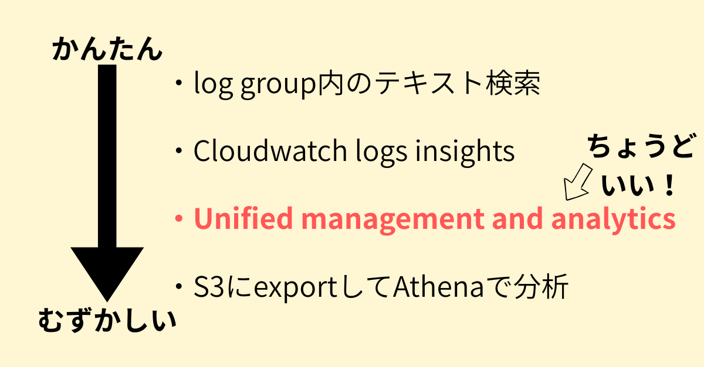
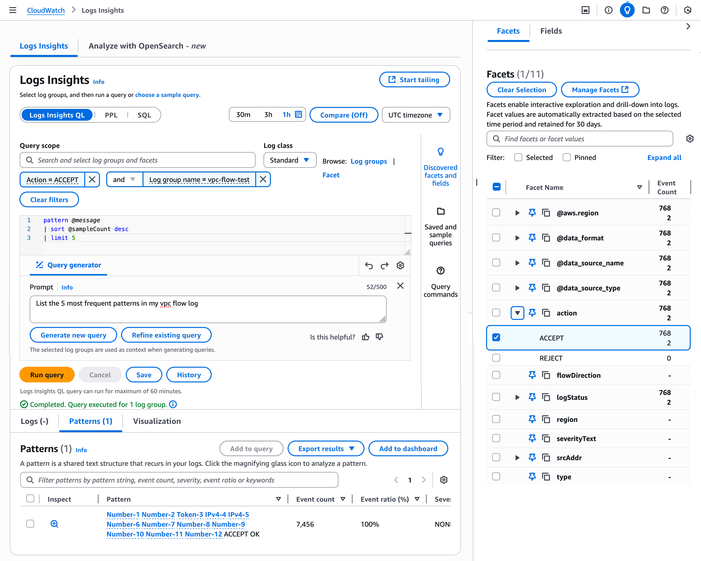

<!-- titleは自動で入る -->
ラスベガスで開催されているAWS re:Inventに参加しています。会社ありがとう...
re:InventではAWSの新しい機能がどんどん発表されてお祭り状態です。中でも、今回僕が個人的にグッと来た機能である「[Amazon CloudWatch launches unified management and analytics for operational, security, and compliance data](https://aws.amazon.com/about-aws/whats-new/2025/12/amazon-cloudwatch-unified-management-analytics/)」と、それに関するセッション「[NEW LAUNCH] Observability & Security unite: Unify your data in Amazon CloudWatch」について書こうと思います。

# Amazon CloudWatch launches unified management and analytics for operational, security, and compliance data は何がすごいのか

これまで、障害対応やセキュリティイベントの確認などでCloudwatch logsの検索をしようと思うと、以下のような方法があったと思います。

- ロググループ内でシンプルな検索
- Cloudwatch logs insights
  - pipe(`|`)でクエリを書けるやつ `fields @timestamp, @message | filter @message like /error/i | limit 20` みたいな
- S3に一旦ログを書き出しておいてからAthenaで分析

今まではちょっと複雑なこと、特に他のログと統合して眺めたい時にはAthenaで都度ワークフローを組んでいました。

それが！今回の Cloudwatch Unified managements and analytics でいい感じになります！

イメージとしてはこんな感じで、従来ではS3にexportして分析するユースケースのうち大半の場合でちょうどいいやつが出てきた、という印象です。

具体的な内容については、セッションの流れを把握する中で把握される方が良いと思うので、セッションの感想を書いてその中で紹介します。

# セッション感想: [NEW LAUNCH] Observability & Security unite: Unify your data in Amazon CloudWatch

- 登壇者
  - Avinav Jami, Director of Software Development, AWS
  - Nikhil Kapoor, Principal Product Manager - Technical, AWS
  - Chandra GP, Director - Cloud Solutions Engineering, S&P Global Inc
- タイプ
  - Breakout session(トークセッション)
- レベル
  - 300 - advanced

このセッションは `[NEW LAUNCH]` とあるように、セッション当日の朝に追加されていたものです。アプリでNewで絞り込んだり、ブラウザでNew launch sessionsで絞り込んだりして見つけました。
内容としては、ざっくり言うと「observability, security, auditのように横断してログを見たい時にデータがバラバラだとよくなくて、Unified management and analyticsを使うと統合して見れて最高！」と言う感じです。

以下、詳細に書きます。

まずこれまでのCloudwatchを利用する人たちの課題が紹介されました。observability, security, auditといった中央集権的に管理して横断で見ているようなチームは、横断して同じデータを見たくなる時があります。しかしそういったユースケースに対して、各チームがデータソースを持っていると横断的に見ることが難しくなります。結果的に、データをコピーして渡したり、といった手間が生じることになり、これは把握に時間がかかってしまいます。つまり、データソースが本来一つになっているべきものが散らばっているとよくない。発表の中ではcomprehensiveではない、MTTD/MTTRの増大、operational overhead, much costの形で悪影響が語られていました。このあたりは横断的な業務をしたことがある人なら他チーム連携の難しさに頭を抱えるんじゃないでしょうか...

続いて、そういった課題に対してAWSが障壁を軽減します！という話になり、Unified data storeが紹介されます。
Unified data storeは4つのステージに分かれています。Collection→Curation→Storage→Insightsという流れです。
Collectionはデータ収集部分、Curationはindex作ったりメタデータを付与してenrichしたり、Storageはそのままの意味で、Insightsが分析です。
個人的なイメージとしては、従来のAthena, Glueでやっていたような処理のうち簡単なものはCurationやInsightsで担えると思いました。
具体的にはCurationはSecurity formatへの変換(外部exportも可能な形式にしておく意味合い)、data source mapping and propagationが該当します。
また、storageのところで7PB+ ingest per monthと言っててマジで？ってなりました。そんなに大量のデータを扱っているの想像もつかない...

新しい要素として、S3 Table Apache iceberg対応とFacetsの話があると感じました。
S3 Table Apache iceberg対応は外部ツールも使えます、が想定されていました。
Facetsがまだあまりよく理解できてないのですが、デモではCloudwatch logs insights的な画面の横にFacetsという画面が出せて、ログを詳細に掘り下げていって支払いの失敗ログが何件、成功ログが何件みたいなのが見れるようになっていました。Insightsの枠ですね。

以下は [Amazon CloudWatch introduces unified data management and analytics for operations, security, and compliance \| AWS News Blog](https://aws.amazon.com/blogs/aws/amazon-cloudwatch-introduces-unified-data-management-and-analytics-for-operations-security-and-compliance/) からの引用画像です。

これやばくて、今までぽちぽちCloudwatch logs insightsでクエリして記録してた作業が無くなります！嬉しい。一括で見れるのはとっても嬉しいです。

それから事例紹介としてS&P Globalの方のお話がありました。
規模がとにかくでかい中でSubstantial volume of log dataにフォーカスして、Unified management and analyticsによってアーキテクチャがどのように変わったかを紹介していました。
この事例紹介わかりやすくて、要は従来S3にデータをそれぞれの用途別に置いていたけどUnifiedのおかげでそれらを省略できてシンプルな構成になった、というストーリーでした。
これはデータが散らばっていると横断の手間があってよくないよね、というメッセージを的確に表していて、S3にデータがそれぞれ別のbucketとして置いてたのをCloudwatchに統合することで楽になったよ、というのは個人的にグッとくるものがありました。
要件が厳しいS&Pでも実用に耐える、というポイントも嬉しいですね。使う後押しになる。

そして気になるお値段の発表がありました。

なんと基本無料！！！！！！なんだこれ！！！！！
特にputに料金を取らず、あくまでデータ保存に対して課金をする姿勢がすごいなと思いました... これは絶対広く使われるようになるやつや...

それからデモとしてpaymentサービスでpayment失敗のログをFacets使って調べるものと、SageMaker Unified Studioとの統合の紹介がされました。会場でSageMaker Unified Studioを使っている人で挙手したのは数人だったので、やっぱりあれまだそんなに普及してないよねと思いました。

また、CloudwatchにData sourceというのができていて、CloudTrailのログを検索したり、複数のdata sourceをまとめてS3 Tableに紐付けるみたいなこともできるようでした。マジですごいアップデートすぎる。
講演では「AI AgentのログとかってVPC flow logやCloudTrailやアプリケーションログなど横断して見たい時あるよね」といった話がされていて、確かにこれからの時代そういうのももっと求められるよなあと思いました。

最後にTakeawayとして、

- data fragmentation slows business outcomes
- Meet your end users where they are
- Choose your deployment model

という3点が共有されて終了となりました。個人的にdata fragmentationはよくないよのところが刺さりすぎた。

# 終わりに

CloudwatchのログをS3に置いてAthenaとかで分析していた時代が部分的に終わるぞ！という実務的な嬉しさと、データをS3 bucket別々に置いてたのって、場合によってはデータがバラバラでよくないことだったんだ...というメッセージを受け取った衝撃がありました。
個人的に一番面白かったアップデート/セッションを紹介できて満足しました！いや〜こういうデータ収集・ETL周りの議論をしたいな〜〜、楽しすぎる。

隣にClassmethodの方が座っていらしゃったのでブログ欲が湧いて勢いで書きました。ここまで読んでいただいた方、ありがとうございました！
