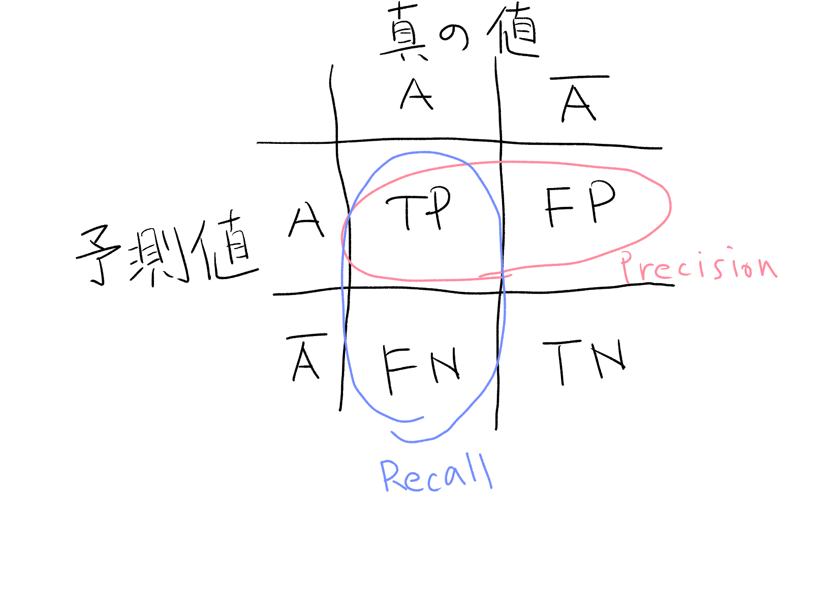

<!-- titleは自動で入る -->
[WANTEDLY TECH BOOK 14：Wantedly執筆部](https://techbookfest.org/product/xzCdC4Hi5YhUMppNtCQzJ9?productVariantID=wNuKYU6EWEiYuiqQEa03KL) を読みました。
2024年の本で、技術書典で物理本を買ってから開かないままでした...
ずいぶん遅くなってしまいましたが、読んだので感想を書きます。読んでいる途中で調べた学びも含みます。

# 第1章 KaggleでNLPコンペに参加して試したこと

今回のタスクの評価指標で、PrecisionとRecallに対して、Recallに5倍掛けた調和平均が使われているという記述を見て「PrecisionとRecall, どっちがどっちだっけ...」となったので調べ直しました。

## PrecisionとRecallの違い

ある値Aかそうでないかを予測する際に、予測した値がA, Aでないの2つ、実際の値がA, Aでないの2つとします。このとき、以下の4つのケースがあり得ます。

- Aと予測し、Aだった: True positive(TP)
- Aと予測し、Aではなかった: False positive(FP)
- Aでないと予測し、Aだった: False negative(FN)
- Aでないと予測し、Aではなかった: True negative(TN)

True/Falseは予測が当たったかどうかを表し、positive/negativeは予測値が求めたい方かそうではないかを表します。
positive/negativeは正/負と日本語で表現されるけど、別に0より大きいとか、真偽値みたいな意味ではない(ここ勘違いしてた) 単に対象かそうではないかというだけ。

さて、以下の図のように整理できます。



- PrecisionはAと予測したのが分母として、TPだったものが分子
- Recallは実際の値がAを分母として、TPだったものが分子

なので、PrecisionとRecallを比較して

- Precisionを重視する場合→FPをゼロに近づけたい→Aと予測したのなら、その中はほとんどAであって欲しい
- Recallを重視する場合→FNをゼロに近づけたい→Aじゃないよと予測したのなら、その中にAはいてほしくない

今回はRecallに5倍掛けている(Recall重視)ということなので、取りこぼしを防ぎたい指標と理解できます。タスクはエッセイから個人情報を抽出するものなので、これは個人情報だ！と判定したケース内に実際は個人情報じゃないものが紛れ込んでいる(FP)よりも、個人情報じゃないです〜と判定したケースの中に実際は個人情報がありました！(FN)の方が重要視されそうですね。FPよりFNの方がゼロに近づけたいので、Recall重視というのは納得できます。

---

内容の感想としては、コンペに実際に参加して手を動かした実感が伝わってきてよかったです。Kaggle詳しくないけど、後処理で泥臭い処理をしたりするんだと思いました。

# 第3章 理想の Terraform ディレクトリ (tfstate) 分割設計を語る

- monorepoにすべき。CI/CD共通にできるから
- tfstateは分割すべき。巨大化するにつれplan/applyの実行時間が長くなるから
- tfstateが相互参照になるまでは分割しない方が良い。参照が一方向なら分割して良い。相互参照は可読性が落ちるから
- ディレクトリ構成は `app/env/main.tf` のようなフラットな形が良い。人間にとって分かりにくくならないように。
  - `app-a/backend/staging/main.tf` のようにするとネストが深くなる。 `app-a-backend/staging/main.tf` が良い。
- moduleを使ってDRYにするより、冗長にコピペ実装した方がいい。条件分岐がつらくなるから。

という感じのことが書かれていて、僕も仕事でterraformを使っていて色々思い出すと、概ね納得できる内容でした。(納得できない部分は主にユースケースの違いから来てそう)
個人的に思ったこととしては、CDKのStack分割も割と相互参照が辛いから似てるな〜と思ったり、ディレクトリ構成やる時に考えていることってkustomizeでk8sのマニフェスト管理する時と似てるかも？と思ったりしました。
kustomizeだとappの下にoverlays/とbase/があって、base/がlibrary扱いでoverlays/が環境差分を吸収するのですが、今回フラット構成、module避ける考えに基づくとここが無くなるイメージ。

```txt
# https://kubectl.docs.kubernetes.io/guides/introduction/kustomize/
~/someApp
├── base
│   ├── deployment.yaml
│   ├── kustomization.yaml
│   └── service.yaml
└── overlays
    ├── development
    │   ├── cpu_count.yaml
    │   ├── kustomization.yaml
    │   └── replica_count.yaml
    └── production
        ├── cpu_count.yaml
        ├── kustomization.yaml
        └── replica_count.yaml
```

# 第4章 Switchback: ネットワーク効果影響下でのオンラインテスト手法

これ面白かったです。知らないことがいっぱい書いてあった。

ある変更を入れて対象にどのような影響があるかを調べたいとします。一般にはA/Bテストのように変更入れるグループとそうでないグループに分割して効果を見る、というのが最初に紹介されています。
しかし、A/Bテストが上手くいかないケースがあります。グループAに加えた影響がグループBに影響してしまう場合です。(今回はダイナミックプライシングを導入する/しないによって、片方のグループで買い控えが起きてもう片方のグループの供給に影響してしまう)これをネットワーク効果と言います。

これに対して別のオンラインテスト手法のswitchbackを使うと解決できる場合があります。変更を入れる/入れないを時間で分割すれば、同じ時間帯で2グループできることが無くなって、片方のグループで買い控え、ということが無くなります。DoorDashでは地理的条件でも分割しています。

個人的な感想としてはネットワーク効果をまず知らなかったので面白かったです。というか一般的なA/Bテストという基礎の導入→それではダメなケースがあるという展開→紹介したい手法の提示、という流れがわかりやすすぎて、こういう記事を書きたいなと思いました。
結局はtreatment/controlのグループ独立性をどう確保するかという問題なのかなと思いました。その視点で見るとA/Bテストは同時刻にグループを分けても独立性のある場合に使える、DoorDashが地理的条件で分割したのは配達員の供給については地理的に独立性があるから、別の地域で同時刻にtreatment/controlが共存してても成り立つ、Switchbackで問題となるキャリーオーバー効果(前の時間のユニットが次の時間のユニットに影響する)は時間分割による独立性が保たれない場合、と理解できそうです。

# 第5章 ゼロから作るベクトル検索

これは学んだことを書きます。あんまり自信はないので間違ってたらこっそり教えてください。

- 参考実装: [chimuichimu/hnsw-python](https://github.com/chimuichimu/hnsw-python)
- 参考実装をコピペしてきて、そこからガチャガチャしてた僕の作業記録: [uta8a/playground#38](https://github.com/uta8a/playground/pull/38)

## HNSWという探索アルゴリズム

ベクトル検索は、ベクトルの集合の中から目的のベクトルに似ている要素を探します。ここで"似ている"というのは指標で定義されます。今回だとコサイン類似度を使います。
以下、ベクトルの集合 $V$ から目的のベクトル $v_t$ に似ている要素を探すとします。

普通に考えると $V$ の要素 $v$ を取ってきて、 $\cos(v, v_t)$ がなるべく1に近いものを探すので、探索にかかる時間はベクトルの集合のサイズ $\vert V\vert$ について線形に増加しそうです。これがNearest Neighbor Search(NNS)です。

NNSでは厳密に解がもとまって嬉しい反面、近似的な解を高速に求めたい場合もあります。そういったものをApproximate Nearest Neighbor Search(ANN)と呼び、HNSWはANNの一種で、探索にかかる時間は $\log \vert V\vert$ です。

HNSWはHierarchical Navigable Small Worldの略です。(これSearchじゃないじゃんと思って[元論文](https://arxiv.org/abs/1603.09320)を読むと、"approximate nearest neighbor search using Hierarchical Navigable Small World graphs"みたいな使われ方をしてたので、厳密にはHNSWはグラフの特徴を言ってる気がします。ただNSW algorithmという表記もあるので、アルゴリズムのことをHNSWと呼ぶのも間違ってなさそう...？)
Small World graphは距離の平均が $\log \vert V\vert$ くらいの、クラスタリング係数が高い(ランダムグラフよりも、局所的に密につながっている部分が多い)ものを指します。イメージとしては点たちが小さくまとまったエリアが複数存在しているグラフって感じですかね。
Navigable Small Worldは近傍探索を貪欲法で行っても対数時間で正解に辿り着けるようなSmall World graphを指します。
Hierarchical Navigable Small Worldはさらに、階層構造としてlayerというのを入れます。これはlayer0を元のgraphとして、元のgraphから点を間引いたものをlayer1, さらに間引いたものをlayer2, ...と持ち上げていきます。数字の大きいlayerでは点と点の距離が長くなっています。
HNSWでは、layerの数字が大きいところから開始します。近傍に移動したらlayerの数字を小さくしてさらに近傍を探索...としていき、最終的にlayer0, 元のgraphの近傍に辿り着きます。感覚的にはlayerの数字が大きいところはダイナミックに移動して近傍に近づき、だんだんlayerを下げていくにつれて細かな動きで近づいていく感じですね。

これは計算量としてはHNSW構築が $N\log N$ かかって探索は1回あたり $\log N$ かかるようです。($N = \vert V\vert$)
探索はlayerを移動するのに $\log N$ で各layer中の動きは定数時間とのことですが、ここはよく分かってないです。

実際動かしてNNSとHNSWを比較しました。

| データ数 | 線形探索(秒) | HNSW探索(秒) | 速度比 |
| -------: | -----------: | -----------: | -----: |
|     1000 |       0.0205 |       0.0935 |  0.2 x |
|     5000 |       0.1014 |       0.1016 |  1.0 x |
|    10000 |       0.2040 |       0.1235 |  1.7 x |
|    20000 |       0.4087 |       0.1324 |  3.1 x |
|    50000 |       1.0231 |       0.1314 |  7.8 x |

NNSは線形で、HNSWは線形よりも性能が良さそう。

---

最後に上手くいかなかった・分からなかったことや感想を雑多にメモしておきます。

- Manimを使って探索の様子を動画にしたかったのだけど上手くいかなかった
  - layerの数字の高いところを探索→低いところに移動→... みたいな動画どうやったら作れるんだろう
- AIが賢すぎてやる気がなくなる
  - コピペして動かして、GitHub Copilotが修正してくれてホイホイと動作してしまったので何を理解したらいいのかやる気が湧かなくなってしまう
  - コードは読んだけど、真に理解した感覚はあまりない。ブログ書いて人に説明する気で整理したらちょっと理解度が増したかも？
- グラフがHNSWであるという判定はどうやって行うのだろうか
  - 今回は性質がいいグラフを構築すると便利、という話だったけど任意のグラフに対して判定問題を考えるとどうなる？
- RAGに使われるのがベクトル検索、というイメージだけど繋がりはよく分からない
  - ドキュメントの検索とベクトル検索の繋がる感じがあまり分かってないかも

# 第6章 過去作ったツールと今

これよかったです。過去に作った小さなツールが、その後どうなったのかを振り返る記事でした。
当時の課題とツールでどう解決したか、そして時間が経ってからメジャーなやり方はこうなりました、というのがセットで書かれています。今はメンテできてない、とか予測を外した、みたいな正直な学びという感じで真に良かった。

- ツールを作ると、似た課題を解決するツールの知識を手に入れて、使い勝手の良さを比較できる
- 詳しくなりたいツールがあると、そのツール周辺でネタを考えると良さそう。アップデート対応を通して詳しくなるチャンスができる
- 他の似たツールの動向が目に入ることで、できること/できないことの感覚が身に付く
  - みんなメンテ放置してるということは難しいということ

という感想を持ちました。

# 第7章 Wantedly グロースチームの概要と施策の取り組み

PRD(プロダクト要求仕様書)が面白かったので調べました。

- [PRD のススメ ~ メンバーや関係者とのスレ違いを減らそう｜あき - 良いもの作って正しく届ける](https://note.com/telq/n/n8a37d345590a)
- [On Writing Product Specs. If you’re a PM at a medium-to-large… \| by Gaurav Oberoi \| Gaurav Oberoi](https://goberoi.com/on-writing-product-specs-5ca697b992fd)

PRDはProduct Requirements Documentの略で、プロジェクトの目的、顧客の課題、どう実現するかが書かれています。
フォーマットとかは色々ありそうですが、「メンバー間で読み合わせてズレを無くす」「PRDに立ち返って機能の必要性やビジネスインパクトがある仕様か度々考える」という点がいいなと思いました。
他の記事も読んで、以下の流れで書くのがいいんじゃないかなと思いました。

- 1時間でドラフトを書く
- 1on1で考えを深める
- 仕様書を書く
  - 目的
  - 計測可能な目標
  - 締切とタイムライン
  - 背景
  - 顧客価値
  - 顧客価値実現のために必要な体験
  - 実現方法
- レビューをもらう
- updateを書く

1on1で考える材料を集めてから仕様書を書くまでちゃんと考える、とかは大事そう。進め方についてはADRに近い部分もありそうですね。
チームの共通言語にフォーマットがあることや、プロダクトの機能を決めて作るという不確実な取り組みに型があるというのは役立ちそう。

# 第8章 いまから始める RAG 開発

RAGについてあんまり知らなかったので勉強になりました。

RAGはRetrieval-Augmented Generationの略で、以下のような流れでユーザーのクエリから回答を生成します。

- Retrieval: ユーザーのクエリを入力として、関連するドキュメントを検索する
- Augment: ユーザーのクエリ、関連するドキュメントを含むプロンプトを作成する
- Generate: LLMによって回答を生成する

ここで、回答をいいものにしたいので評価することを考えます。
Metrics Driven Development(MDD)はRAGアプリケーションに対して精度を定義して数値評価を継続して記録・監視するというものです。
LLMだと回答にブレが出るので決定的なテストを行うのが難しく、評価時にLLMを使うことでそのブレをLLM側で吸収することで評価がブレにくくします。

あとは実際のRAGの改善手法が紹介されていました。正直ここからはRAGの評価環境を作ってみないと分からないところもありそうなので、時間ができた時に評価環境を作ってみようと思います。見たところ別にローカルLLM必須という訳でもなさそう？な気がする。データセットの用意が大変そう...
